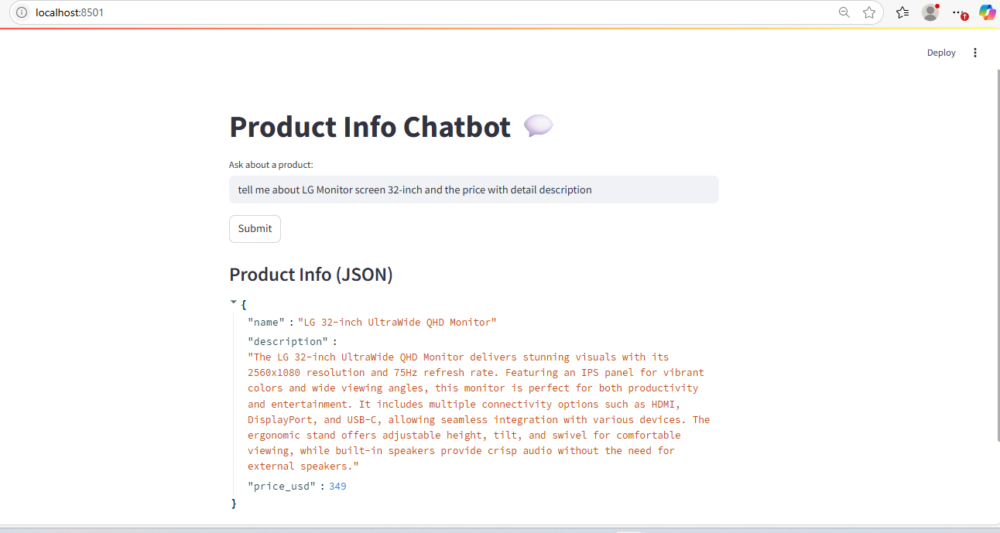
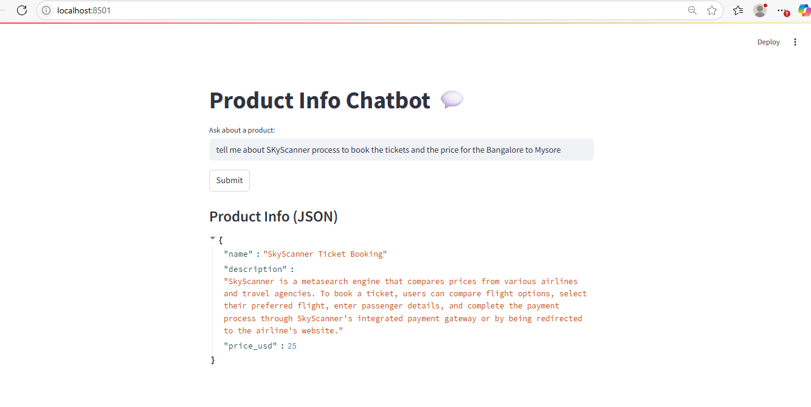

Step 1- Create environment - .env file
    Keep you secret keys inside .env and format should be:

    OPENAI_API_KEY=your_openai_key
    GROQ_API_KEY=your_groq_key
    LANGCHAIN_API_KEY=your_langchain_key
    LANGCHAIN_PROJECT=your_project_name

Step 2- Requiremts : there are 2 ways to install
  
    1- pip install -r requirements.txt
    2- install the libraries using "pip install lib" 
            streamlit
            langchain
            langchain-openai
            pydantic
            python-dotenv
            eg - pip install streamlit

Step 3 - To run the code

📦 1. Clone or Set Up Your Project

        mkdir langchain-chatbot
        cd langchain-chatbot

    2- Create a .env file: refer step no 1
🛠  3. Set Up Python Environment

        Create a virtual environment:

        python -m venv venv
        source venv/bin/activate  # Linux/MAc
        venv\Scripts\activate # On Windows use: 

        Install dependencies: refer step 2

            pip install -r requirements.txt

        If you don’t have a requirements.txt yet, run this to generate one:

            pip install streamlit langchain langchain-openai pydantic python-dotenv
            pip freeze > requirements.txt

🧪 4. Run the Streamlit App
        streamlit run main.py
        Streamlit will open in your browser at http://localhost:8501.

🧵 5. How It Works
    1- You input a natural language product query.
    2- LangChain sends it to the OpenAI model.
    3- The response is parsed using a Pydantic model.
    4- The result is shown in structured JSON in the UI.

🐛 Troubleshooting Tips
    1- Missing API Key? Make sure .env is present and keys are valid.
    2- Model not available? Double-check you're using a supported model like "gpt-3.5-turbo" or "o1-mini".
    3- Invalid output? Try printing intermediate steps in chain.py.

## 💻 Demo

